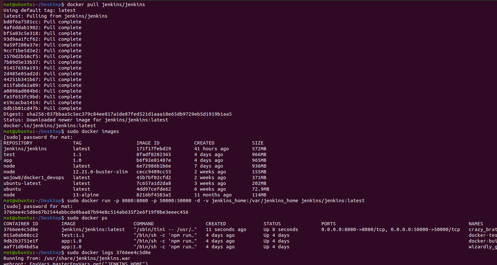
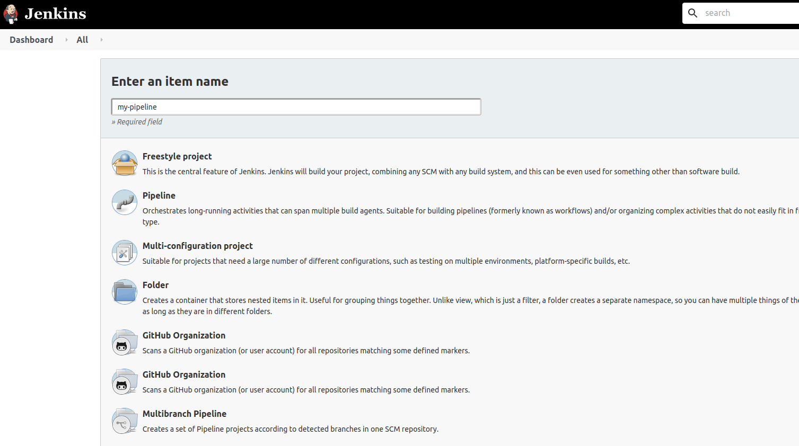
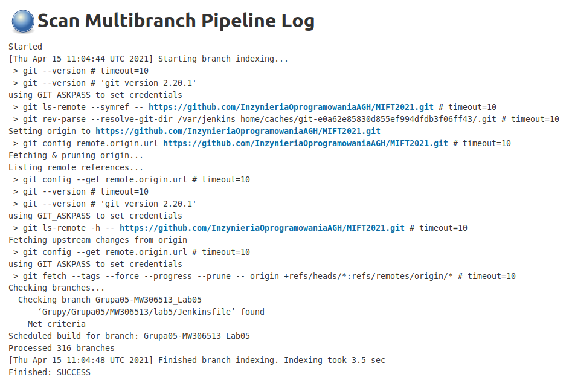
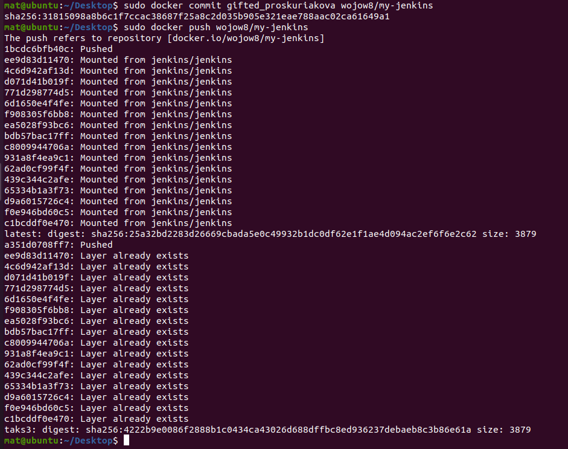
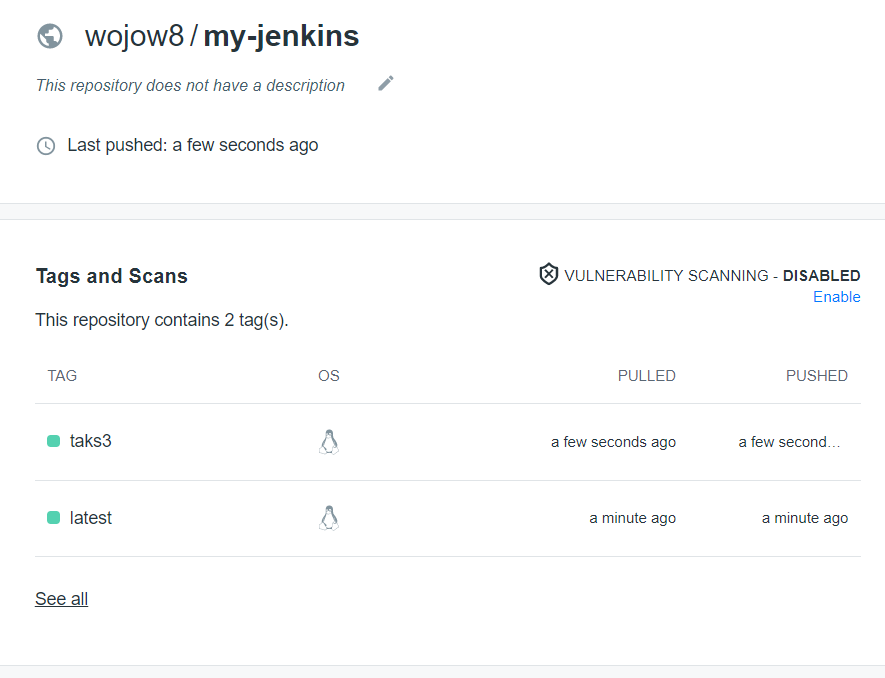

# 1. Utworzenie kontenera z jenkinsem

# 2
Odpalenie kontera 
sudo docker run -p 8080:8080 -p 50000:50000 -d -v jenkins_home:/var/jenkins_home jenkins/jenkins:lts-jdk11
1 port to port dla Jenkinsa 
2 dla komunikacji typu Master / Slave
-d detached mode zebym dalej mogl sobie pisac w tej samej konsoli
-v tworze w kontenerze docker volume dla folderu jenkins_home przy okazji dzieki temu nie mam problemow z dostepem 

nastepnie zczytalem haslo z logow do zainicjalizowania jenkinsa

INSTALOWANIE 

.png)

Utworzylem nowe zadanie

Uruchomienie pipelina w poszukiwaniu Jenkinsfile 

# 3
Wrzucanie na docker huba

Pierwszy push byl bez taga dlatego sa dwa

